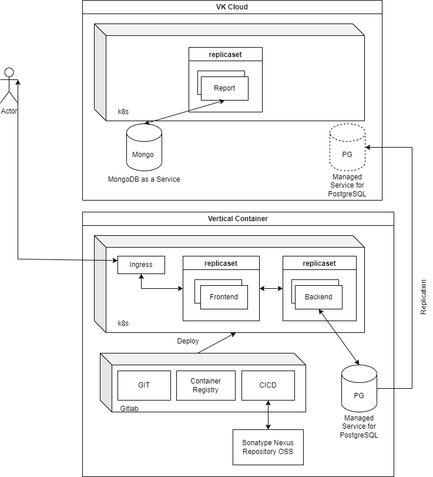

# Исходные данные приложения сосисочной

Приложение состоит из трёх основных компонентов frontend, backend и report.
Бизнес хорошо идёт, высокие требования к отказоустойчивости.

### Приложения:

|Наименование|Стэк|хранение сессий|хранение данных|
|-|-|-|-|
|Backend|Java|Да|Да|
|Frontend|JS|Нет|Нет|
|Report|Python|Нет|Да|

### Хранилища
|Наименование|Зависимые|
|-|-|
|Postgresql|Backend|
|Mongo DB|Report|

### Схема

### Резюме.

Плюсы:
 - отказоустойчивость - за счёт оркестрации k8s;
 - доступоность - за счёт репликации и дублирования k8s;
 - масштобирование.

Минусы:
 - высокая стоимость;
 - требования к сопровождаемости и поддержки - необходимо поддерживать правильные версии ПО, реплики и т.д.